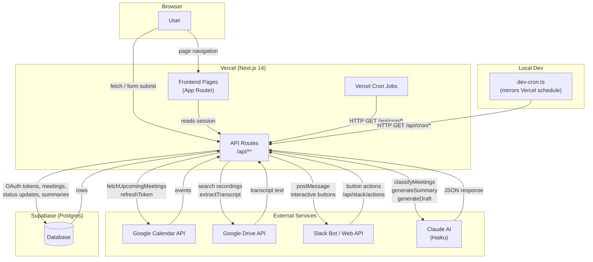
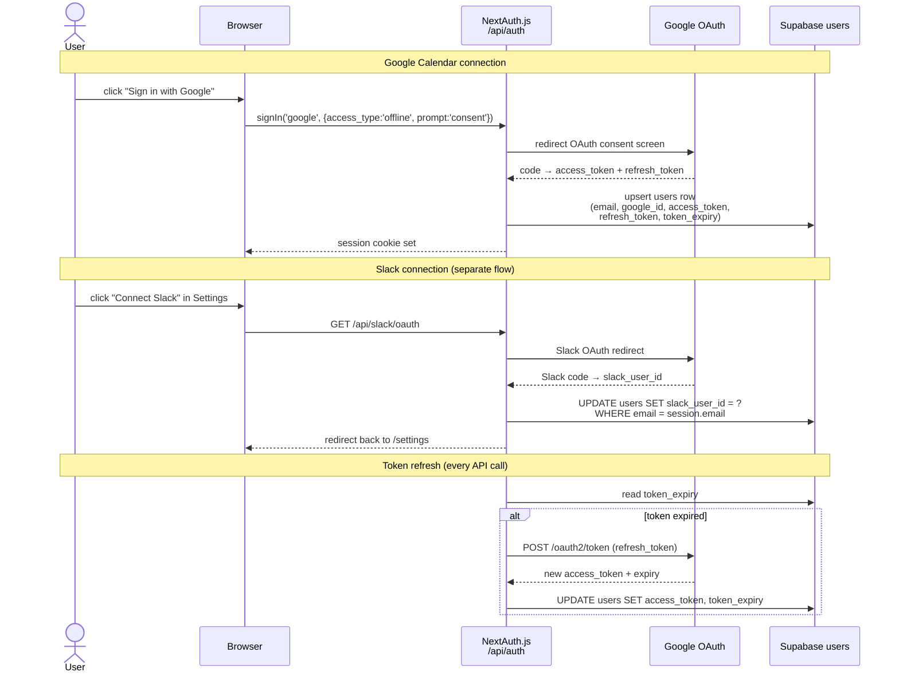
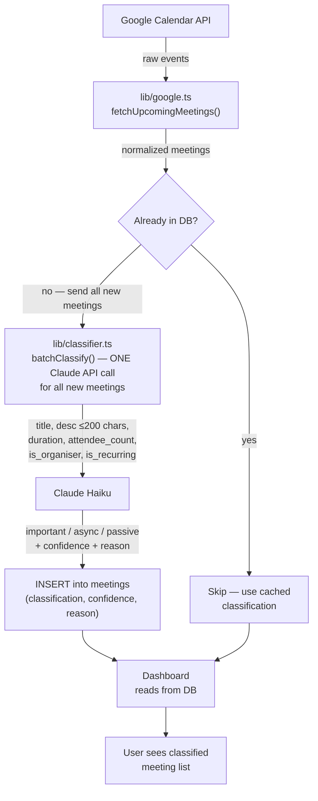
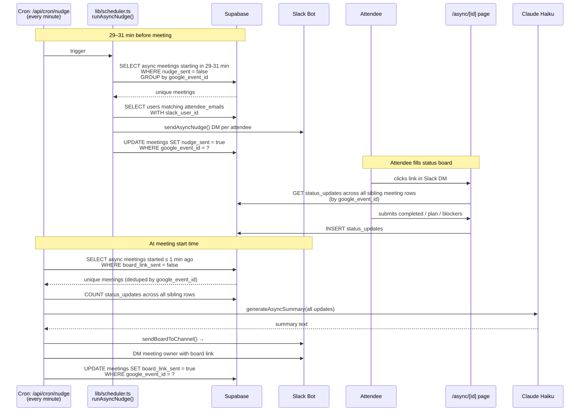
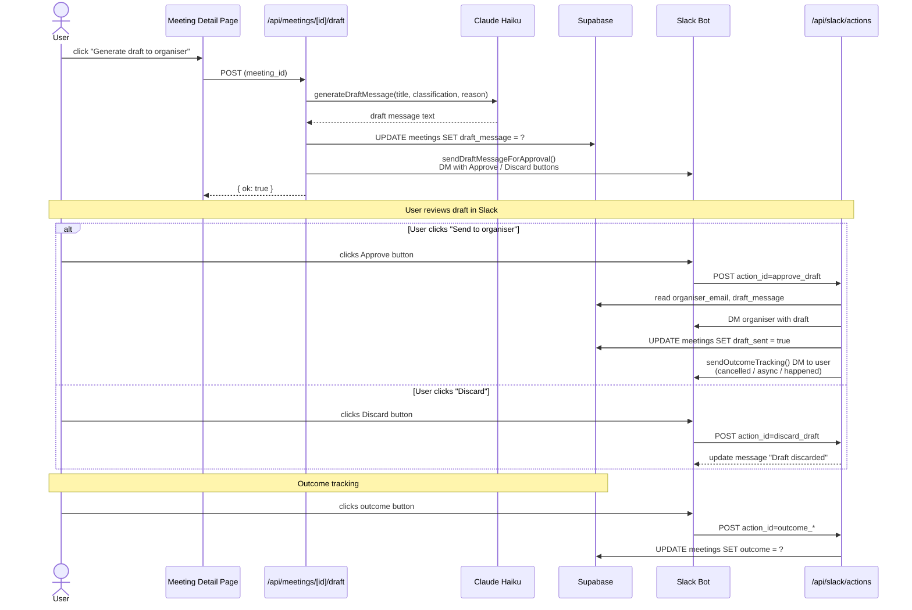
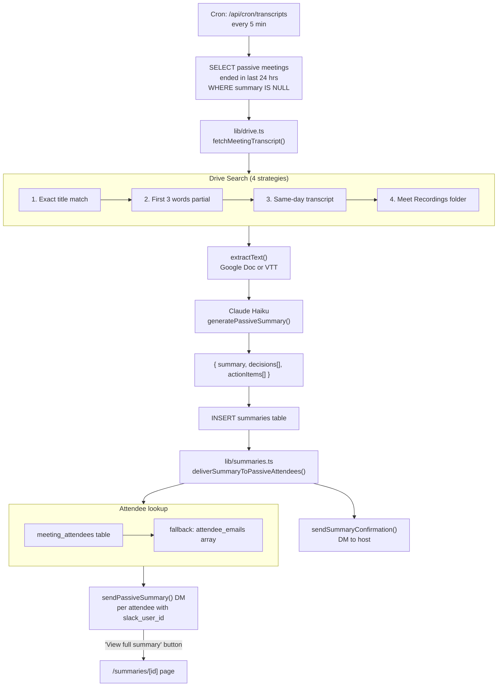
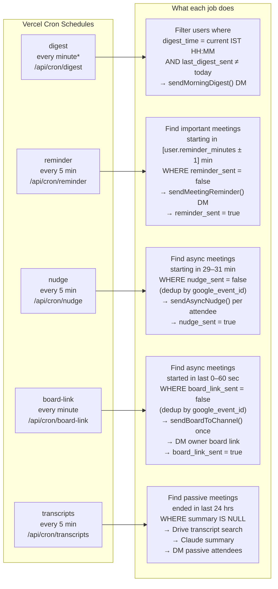
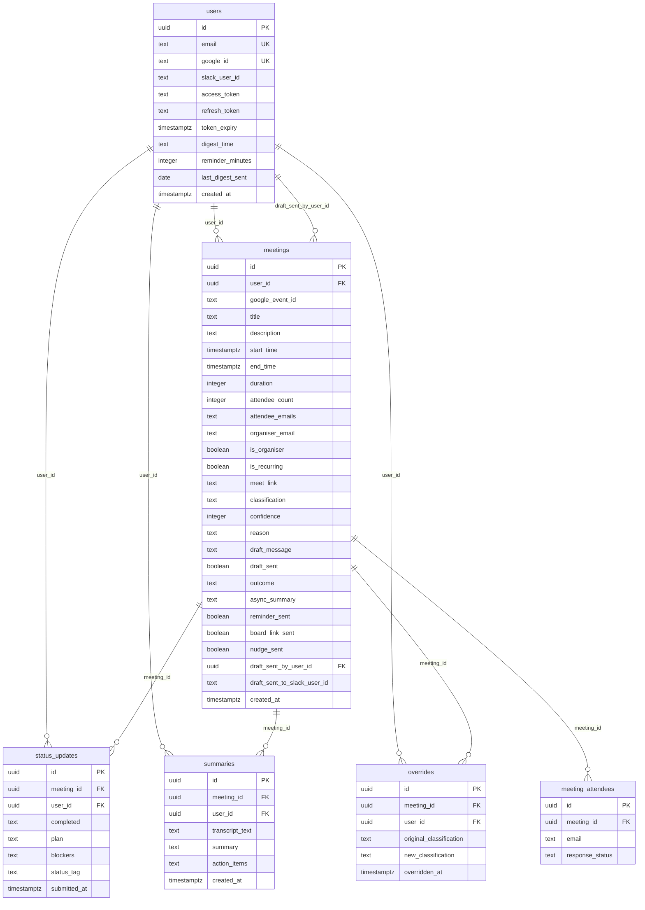

# Meetless — Architecture

## 1. System Overview

---

## 2. Authentication Flow

---

## 3. Meeting Classification Flow

---

## 4. Async Status Board Flow

---

## 5. Draft Message Flow

---

## 6. Passive Meeting Flow

---

## 7. Cron Jobs

> \* digest runs every minute but each user's digest fires once per day at their configured IST time, guarded by `last_digest_sent`.

---

## 8. Database Schema

---

## Key Design Decisions

| Decision | Reason |
|---|---|
| One meetings row per user per event | Each user's `is_organiser`, `classification`, `reminder_sent` etc. are personal — not shared |
| `google_event_id` as cross-user key | All cron jobs deduplicate by this to fire once per calendar event |
| `status_updates` queried across sibling rows | Attendees may submit via different meeting row URLs — GET uses `.in('meeting_id', allSiblingIds)` |
| `supabaseAdmin` (service role) for all server writes | Bypasses RLS; never exposed to the client |
| Claude Haiku only | Cost and latency optimised; system prompts kept under 100 tokens |
| Slack = lightweight surface | Links back to website for all detail; no full data in DMs |
| AI drafts always need approval | `sendDraftMessageForApproval()` — never auto-sent to organiser |
